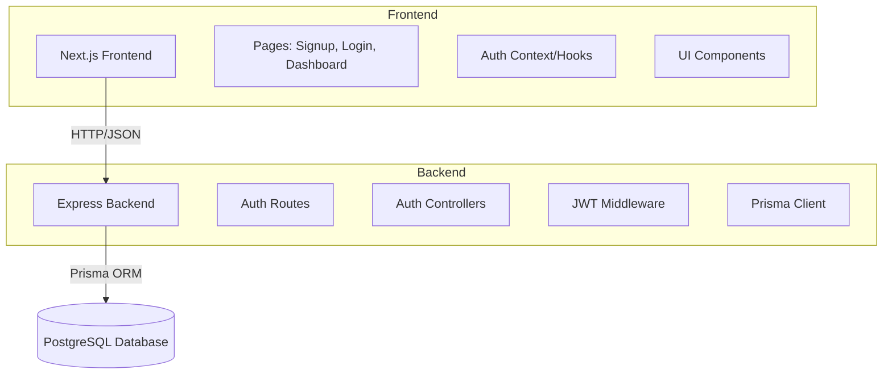

# Design Document

## Overview

This application is a full-stack role-based authentication system built with Next.js (frontend) and Node.js/Express (backend). It uses JWT for stateless authentication, PostgreSQL with Prisma for data persistence, and follows a clean separation between frontend and backend concerns.

The architecture prioritizes simplicity, security, and deployability while meeting all core requirements for role-based authentication.

## Architecture

### High-Level Architecture



### Technology Stack

**Frontend:**
- Next.js 14+ with TypeScript
- TailwindCSS for styling
- Axios for HTTP requests
- React Context for auth state management
- React Hook Form + Zod for form validation

**Backend:**
- Node.js with Express
- TypeScript
- Prisma ORM
- PostgreSQL (Supabase/Neon free tier)
- bcrypt for password hashing
- jsonwebtoken for JWT generation/verification
- express-validator for request validation

### Deployment Strategy

- **Frontend**: Vercel (automatic deployment from Git)
- **Backend**: Render or Railway (containerized deployment)
- **Database**: Supabase or Neon (managed PostgreSQL)

## Components and Interfaces

### Backend Components

#### 1. Database Schema (Prisma)

```prisma
model User {
  id        String   @id @default(cuid())
  email     String   @unique
  name      String
  password  String
  role      Role     @default(USER)
  createdAt DateTime @default(now())
  updatedAt DateTime @updatedAt

  @@index([email])
}

enum Role {
  USER
  ADMIN
}
```

#### 2. API Endpoints

**POST /auth/signup**
- Request Body: `{ name: string, email: string, password: string, role: "USER" | "ADMIN" }`
- Response: `{ message: string, user: { id, email, name, role } }`
- Status Codes: 201 (Created), 400 (Validation Error), 409 (Email Exists)

**POST /auth/login**
- Request Body: `{ email: string, password: string }`
- Response: `{ token: string, user: { id, email, name, role } }`
- Status Codes: 200 (OK), 400 (Validation Error), 401 (Invalid Credentials)

**GET /auth/me**
- Headers: `Authorization: Bearer <token>`
- Response: `{ user: { id, email, name, role } }`
- Status Codes: 200 (OK), 401 (Unauthorized)

#### 3. Authentication Middleware

```typescript
// Middleware to verify JWT and attach user to request
interface AuthRequest extends Request {
  user?: {
    id: string;
    email: string;
    name: string;
    role: string;
  };
}

// Verifies JWT token from Authorization header
// Decodes payload and attaches user info to request
// Returns 401 if token is missing, invalid, or expired
```

#### 4. Password Security

- Use bcrypt with salt rounds of 10
- Hash passwords before storing in database
- Compare hashed passwords during login
- Never return password hashes in API responses

#### 5. JWT Configuration

- Secret key stored in environment variable
- Token expiration: 7 days
- Payload includes: userId, email, name, role
- Signed using HS256 algorithm

### Frontend Components

#### 1. Page Structure

**pages/signup.tsx**
- Form with fields: name, email, password, role (dropdown)
- Client-side validation using Zod schema
- Submits to POST /auth/signup
- Redirects to /login on success

**pages/login.tsx**
- Form with fields: email, password
- Client-side validation
- Submits to POST /auth/login
- Stores JWT in localStorage
- Redirects to /dashboard on success

**pages/dashboard.tsx**
- Protected route (requires authentication)
- Displays: "Welcome, [Name] (User)" or "Welcome, [Name] (Admin)"
- Fetches user data from GET /auth/me on mount
- Redirects to /login if not authenticated

#### 2. Authentication Context

```typescript
interface AuthContextType {
  user: User | null;
  token: string | null;
  login: (email: string, password: string) => Promise<void>;
  logout: () => void;
  isAuthenticated: boolean;
  isLoading: boolean;
}

// Provides auth state and methods throughout the app
// Manages token storage in localStorage
// Handles automatic token validation on app load
```

#### 3. Protected Route Component

```typescript
// Wrapper component for protected pages
// Checks authentication status
// Redirects to /login if not authenticated
// Shows loading state while checking auth
```

#### 4. API Client Configuration

```typescript
// Axios instance with base URL
// Automatically attaches JWT token to requests
// Handles 401 responses by redirecting to login
// Centralized error handling
```

## Data Models

### User Model

```typescript
interface User {
  id: string;
  email: string;
  name: string;
  role: 'USER' | 'ADMIN';
  createdAt: Date;
  updatedAt: Date;
}

// Password field excluded from TypeScript interface
// Only exists in database, never returned to client
```

### Authentication Tokens

```typescript
interface JWTPayload {
  userId: string;
  email: string;
  name: string;
  role: 'USER' | 'ADMIN';
  iat: number;  // Issued at
  exp: number;  // Expiration
}
```

### API Request/Response Types

```typescript
// Signup Request
interface SignupRequest {
  name: string;
  email: string;
  password: string;
  role: 'USER' | 'ADMIN';
}

// Login Request
interface LoginRequest {
  email: string;
  password: string;
}

// Auth Response
interface AuthResponse {
  token: string;
  user: {
    id: string;
    email: string;
    name: string;
    role: 'USER' | 'ADMIN';
  };
}

// Error Response
interface ErrorResponse {
  error: string;
  details?: string[];
}
```

## Error Handling

### Backend Error Handling

1. **Validation Errors (400)**
   - Invalid email format
   - Password too short
   - Missing required fields
   - Invalid role value

2. **Authentication Errors (401)**
   - Invalid credentials
   - Missing JWT token
   - Expired JWT token
   - Invalid JWT signature

3. **Conflict Errors (409)**
   - Email already registered

4. **Server Errors (500)**
   - Database connection failures
   - Unexpected errors

**Error Response Format:**
```json
{
  "error": "Human-readable error message",
  "details": ["Specific validation errors"]
}
```

### Frontend Error Handling

1. **Form Validation**
   - Client-side validation before submission
   - Display field-level error messages
   - Prevent submission of invalid data

2. **API Error Display**
   - Show error messages from backend
   - Toast notifications for errors
   - Form-level error display

3. **Network Errors**
   - Handle connection failures
   - Retry logic for transient failures
   - User-friendly error messages

4. **Authentication Errors**
   - Redirect to login on 401
   - Clear invalid tokens
   - Show session expired message

## Testing Strategy

### Backend Testing

1. **Unit Tests**
   - Password hashing functions
   - JWT generation and verification
   - Input validation logic

2. **Integration Tests**
   - POST /auth/signup endpoint
   - POST /auth/login endpoint
   - GET /auth/me endpoint
   - Authentication middleware

3. **Test Database**
   - Use separate test database
   - Reset database between tests
   - Seed test data as needed

### Frontend Testing

1. **Component Tests**
   - Signup form rendering and validation
   - Login form rendering and validation
   - Dashboard display with user info

2. **Integration Tests**
   - Complete signup flow
   - Complete login flow
   - Protected route access
   - Logout functionality

3. **E2E Tests (Optional)**
   - Full user journey from signup to dashboard
   - Role-based access verification

## Security Considerations

1. **Password Security**
   - Minimum password length: 8 characters
   - Bcrypt hashing with salt rounds: 10
   - Never log or expose passwords

2. **JWT Security**
   - Strong secret key (minimum 32 characters)
   - Appropriate expiration time
   - HTTPS only in production
   - HttpOnly cookies (alternative to localStorage)

3. **Input Validation**
   - Validate all inputs on backend
   - Sanitize user inputs
   - Use parameterized queries (Prisma handles this)

4. **CORS Configuration**
   - Whitelist frontend domain
   - Restrict allowed methods
   - Proper credentials handling

5. **Environment Variables**
   - Never commit secrets to Git
   - Use .env.example template
   - Different secrets for dev/prod

## Deployment Configuration

### Environment Variables

**Backend (.env)**
```
DATABASE_URL=postgresql://...
JWT_SECRET=your-secret-key-min-32-chars
PORT=5000
NODE_ENV=production
FRONTEND_URL=https://your-frontend.vercel.app
```

**Frontend (.env.local)**
```
NEXT_PUBLIC_API_URL=https://your-backend.render.com
```

### Build and Deploy Steps

**Backend (Render/Railway):**
1. Connect GitHub repository
2. Set environment variables
3. Build command: `npm install && npx prisma generate && npm run build`
4. Start command: `npm start`
5. Run migrations: `npx prisma migrate deploy`

**Frontend (Vercel):**
1. Connect GitHub repository
2. Set environment variables
3. Framework preset: Next.js
4. Automatic build and deploy on push

### Database Setup

1. Create PostgreSQL database on Supabase/Neon
2. Copy connection string
3. Set DATABASE_URL in backend environment
4. Run Prisma migrations
5. Verify connection

## File Structure

```
project-root/
├── backend/
│   ├── src/
│   │   ├── controllers/
│   │   │   └── authController.ts
│   │   ├── middleware/
│   │   │   └── authMiddleware.ts
│   │   ├── routes/
│   │   │   └── authRoutes.ts
│   │   ├── utils/
│   │   │   ├── jwt.ts
│   │   │   └── password.ts
│   │   ├── types/
│   │   │   └── index.ts
│   │   └── index.ts
│   ├── prisma/
│   │   └── schema.prisma
│   ├── .env.example
│   ├── package.json
│   └── tsconfig.json
│
├── frontend/
│   ├── src/
│   │   ├── app/
│   │   │   ├── signup/
│   │   │   │   └── page.tsx
│   │   │   ├── login/
│   │   │   │   └── page.tsx
│   │   │   ├── dashboard/
│   │   │   │   └── page.tsx
│   │   │   └── layout.tsx
│   │   ├── components/
│   │   │   ├── ProtectedRoute.tsx
│   │   │   └── ui/
│   │   ├── contexts/
│   │   │   └── AuthContext.tsx
│   │   ├── lib/
│   │   │   ├── api.ts
│   │   │   └── validations.ts
│   │   └── types/
│   │       └── index.ts
│   ├── .env.example
│   ├── package.json
│   └── tsconfig.json
│
└── README.md
```

## Design Decisions and Rationale

1. **JWT over Sessions**: Stateless authentication simplifies deployment and scaling, especially with separate frontend/backend deployments.

2. **PostgreSQL with Prisma**: Type-safe database access, excellent TypeScript integration, and easy migrations. Prisma's generated client reduces boilerplate.

3. **Next.js App Router**: Modern Next.js architecture with better performance and developer experience. Server components where beneficial.

4. **Monorepo Structure**: Separate backend and frontend directories for clear separation of concerns while keeping everything in one repository.

5. **localStorage for Token Storage**: Simple implementation for MVP. Can be upgraded to httpOnly cookies for enhanced security in future iterations.

6. **TailwindCSS**: Rapid UI development with utility classes, small bundle size, and excellent developer experience.

7. **Zod for Validation**: Type-safe validation that works on both client and server, with excellent TypeScript integration.

8. **Role Enum in Database**: Ensures data integrity and makes role-based logic type-safe throughout the application.
